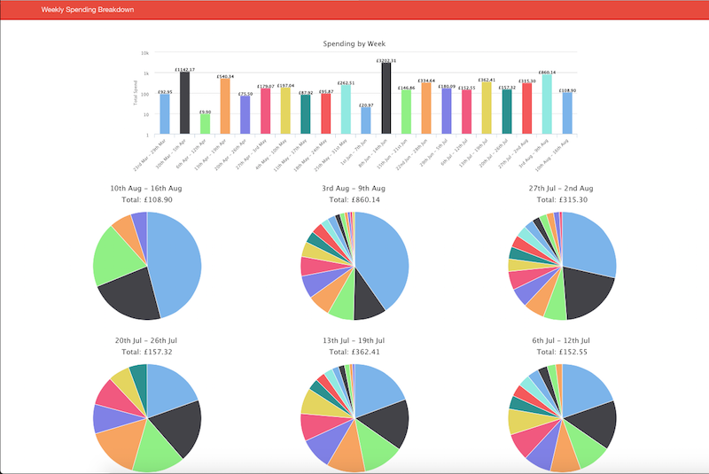

Bank Statement Visualisation
============================

I wanted a better way to visualise my spending using the online statements available in my Santander online banking, so I
built this. Currently it only works for the TXT format used on the Santander online banking, however the code is modular
so there is the possibility of switching in parsers for different formats from different banks.

This project consists of a Python script which processes the transaction file and generates a HTML file displaying a bar chart of the total
spent on a weekly basis, as well as pie charts showing what money was spent on each week. The number of weeks to look back can be specified.
There is also some logic to replace the names of some common transactions with shorter and more readable ones, and to aggregate similar
transactions. This allows, for example, all transactions made in a Tesco store are grouped into a single segment on the pie chart.
